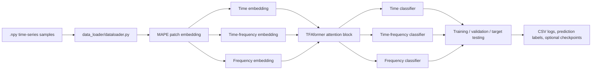

# Device-Agnostic Modality-Adaptive Perception Embedding and Universal Time–Frequency Aggregation Transformer for Unknown-Domain Fault Diagnosis
# TFAformer

🌐 **Code release for an IFAC conference paper on time-frequency-aware Transformer modeling for cross-domain fault diagnosis.**

This repository contains the training pipeline, data-loading utilities, time-frequency patch embedding module, and Transformer-based classification model used in the IFAC experiments.

> ✅ IDE/cache folders are intentionally omitted from this README: `.idea/`, `.pytest_cache/`, `.vscode/`, and `__pycache__/`.

---

## ✨ Highlights

- 🧠 **TFAformer backbone** with time-domain, frequency-domain, and time-frequency fusion branches.
- 🧩 **MAPE-style patch embedding** that extracts random time-channel patches and FFT-amplitude features.
- 🔁 **Multi-source transfer tasks** with three source domains and one target domain.
- 📊 **Automatic experiment logging** for accuracy, loss, time cost, prediction labels, and summary statistics.
- 🎯 **Configurable decision branches**: time only, frequency only, time-frequency only, or averaged fusion.

---

## 🗂️ Repository Structure

```text
TFAformer/
|-- main.py
|-- Paper.pdf
|-- README.md
|-- dataset/
|   |-- file_path.py
|   |-- BJUT_WT_64_samples_all_speed/
|   |-- PU_datasets_4classes_4096_1samples/
|-- data_loader/
|   |-- dataloader.py
|-- Embedding/
|   |-- MAPE.py
|-- models/
|   |-- Multimodal_model.py
|   |-- TFAformer_attention_time_series.py
|   |-- TFAformer_block_time_series.py
|   |-- TFAformer_model_time_series.py
|-- save_dir/
|   |-- IFAC_Time_frequency/
|       |-- lr_0.0003/
|           |-- TFAformer/
|               |-- PU_datasets_4classes_4096_1samples/
|               |-- SCARA_multi_modal_datasets/
|-- utils_dsbn/
|   |-- save_other_functions.py
|   |-- train_utils.py
```

### 📁 Folder Guide

| Folder | Description |
| --- | --- |
| `dataset/` | Dataset root folder. It stores `.npy` data/label files and the dataset-task mapping script. |
| `dataset/PU_datasets_4classes_4096_1samples/` | PU bearing dataset files for the 4-class setting. Each condition has a `*_data.npy` and `*_label.npy` file. |
| `dataset/BJUT_WT_64_samples_all_speed/` | BJUT-WT dataset files used by the IFAC transfer tasks. Each speed condition has a `*_data.npy` and `*_label.npy` file. |
| `data_loader/` | PyTorch data-loading utilities, dataset wrappers, split logic, and optional normalization helpers. |
| `Embedding/` | Time-frequency embedding modules. The current model uses `MAPE.py`. |
| `models/` | TFAformer model components, including the attention layer, Transformer block, full encoder, and top-level wrapper. |
| `utils_dsbn/` | Reusable training utilities, loss helpers, learning-rate tools, monitors, and CSV-saving helpers. |
| `save_dir/` | Generated experiment outputs, including CSV summaries, prediction labels, and optional model checkpoints. |
| `save_dir/IFAC_Time_frequency/` | Default output root used by `main.py`. |
| `save_dir/IFAC_Time_frequency/lr_0.0003/` | Results grouped by learning rate. |
| `save_dir/IFAC_Time_frequency/lr_0.0003/TFAformer/` | Results grouped by model/weight setting. |
| `save_dir/.../<dataset_name>/` | Dataset-specific experiment records. |
| `save_dir/.../<dataset_name>/T0/` | Transfer-task result folder. Other task folders such as `T20`, `T25`, `T30`, and `T35` may be created depending on the dataset. |
| `save_dir/.../<dataset_name>/T0/1/` | Repeat-run output folder. During training, repeat folders may be renamed to include the best accuracy. |

---

## 📦 Dataset

The dataset archive is provided through Baidu Netdisk:

- 🔗 **File**: `dataset.rar`
- 🌍 **Link**: [https://pan.baidu.com/s/1VXXAApChzAAEVZbOiDSbuA?pwd=IFAC](https://pan.baidu.com/s/1VXXAApChzAAEVZbOiDSbuA?pwd=IFAC)
- 🔑 **Extraction code**: `IFAC`
- **🚀 Google Driv**: [https://drive.google.com/file/d/1wfHlMhoXZvCZmDXnq-zDY_7lfsBiyzqb/view?usp=drive_link](https://drive.google.com/file/d/1wfHlMhoXZvCZmDXnq-zDY_7lfsBiyzqb/view?usp=drive_link)

After downloading and extracting `dataset.rar`, place the extracted folders under `dataset/`. The default IFAC configuration expects paths such as:

```text
dataset/
|-- PU_datasets_4classes_4096_1samples/
|   |-- PU_N09_M07_F10_data.npy
|   |-- PU_N09_M07_F10_label.npy
|   |-- PU_N15_M01_F10_data.npy
|   |-- PU_N15_M01_F10_label.npy
|   |-- PU_N15_M07_F04_data.npy
|   |-- PU_N15_M07_F04_label.npy
|   |-- PU_N15_M07_F10_data.npy
|   |-- PU_N15_M07_F10_label.npy
|-- BJUT_WT_64_samples_all_speed/
|   |-- BJUT_20Hz_5_data.npy
|   |-- BJUT_20Hz_5_label.npy
|   |-- BJUT_25Hz_5_data.npy
|   |-- BJUT_25Hz_5_label.npy
|   |-- BJUT_30Hz_5_data.npy
|   |-- BJUT_30Hz_5_label.npy
|   |-- BJUT_35Hz_5_data.npy
|   |-- BJUT_35Hz_5_label.npy
```

📌 Transfer-task definitions are maintained in `dataset/file_path.py`. The script currently includes mappings for PU, BJUT-WT, SCARA, and HUST-style tasks.

---

## ⚙️ Environment

Recommended environment:

- Python 3.8+
- PyTorch
- NumPy, pandas, SciPy, scikit-learn
- matplotlib, tqdm
- einops

Install common dependencies:

```bash
pip install torch numpy pandas scipy scikit-learn matplotlib tqdm einops
```

If you use CUDA, install the PyTorch build that matches your local CUDA driver.

---

## 🚀 Quick Start

1. 📥 Download and extract the dataset archive into `dataset/`.
2. 🔧 Check the experiment settings in `main.py`.
3. ▶️ Run the default training script:

```bash
python main.py
```

The default configuration runs multiple learning-rate/dataset/task/repeat experiments and can take a long time. For a quick smoke test, reduce:

```text
--n_epoch
--repeat_times
--dataset_names
--PU_transfer_tasks
--BJUT_transfer_tasks
```

Most grid-style options are stored as Python lists in `main.py`, so editing the defaults directly is usually the simplest workflow.

---

## 🧠 Model Workflow



The default branch setting is:

```text
decision_domain = Time_TimeAndFreq_Freq
```

This averages the logits from the time, time-frequency, and frequency classifiers.

---

## 3. Introduction to TFAformer Program Documents

### 3.1 Introduction to Functions or Classes Contained in Program Files

**To train the model, please run `main.py` first.**

- **`main.py`**
  - Name: Main function and experiment controller.
  - Function: Configures hyperparameters, selects datasets and transfer tasks, builds source/target data loaders, trains TFAformer, evaluates source validation and target test accuracy, and saves experiment records.
  - Main functions: `model_test()`, `train()`, `set_seed()`.

- **`dataset/file_path.py`**
  - Name: Dataset path and transfer-task definition file.
  - Function: Defines the source-domain datasets, target-domain datasets, dataset root paths, task names, and class numbers for PU, BJUT-WT, SCARA, and HUST-style experiments.
  - Main functions: `datasets_path()`, `datasets_path_0()`.

- **`data_loader/dataloader.py`**
  - Name: Data loading module.
  - Function: Loads `.npy` and `.mat` data files, wraps data as PyTorch datasets, constructs training/validation/test data loaders, fixes random seeds, and provides optional channel-wise normalization utilities.
  - Main functions/classes: `MyDataSet`, `data_load_time_series()`, `data_reader_fn()`, `dataload()`, `test_dataload()`, `channel_wise_standardize()`, `channel_wise_power_then_standardize()`, `set_seed()`.

- **`Embedding/MAPE.py`**
  - Name: MAPE time-frequency embedding module.
  - Function: Extracts random time-channel patches from multi-channel time-series signals, embeds time information, computes FFT amplitude features, and outputs time-domain, time-frequency-domain, and frequency-domain patch embeddings.
  - Main class: `E_01_HSE2_return_TF`.

- **`models/Multimodal_model.py`**
  - Name: Top-level multimodal TFAformer wrapper.
  - Function: Builds the shared TFAformer backbone and returns three classification outputs corresponding to the time branch, time-frequency branch, and frequency branch.
  - Main class: `Multimodal_model_Mul_domain_tf`.

- **`models/TFAformer_model_time_series.py`**
  - Name: Full TFAformer model for time-series classification.
  - Function: Calls the MAPE embedding module, adds class tokens and positional embeddings, applies the TFAformer encoder, pools the encoded tokens, and produces prediction logits through separate classification heads.
  - Main class: `Time_series_transformer_Mul_domain_tf`.

- **`models/TFAformer_block_time_series.py`**
  - Name: TFAformer encoder block file.
  - Function: Defines the feed-forward network and stacked Transformer encoder layers used to process the time, time-frequency, and frequency embeddings with residual connections.
  - Main functions/classes: `FeedForward`, `Transformer_block_single_domain_tf_mul_layer`, `pair()`.

- **`models/TFAformer_attention_time_series.py`**
  - Name: Attention module.
  - Function: Computes self-attention for time-domain and frequency-domain embeddings, performs time-frequency cross-attention/fusion, and supports different fusion operations such as `cat_in_v`.
  - Main class: `Attention_single_domain_tf`.

- **`utils_dsbn/train_utils.py`**
  - Name: Training utility module.
  - Function: Provides learning-rate scheduling, adaptation-factor scheduling, weighted classification losses, KL/KD losses, weight initialization, optimizer parameter grouping, metric monitoring, label-noise injection, and one-hot encoding.
  - Main functions/classes: `adaptation_factor()`, `lr_poly()`, `wce_loss()`, `wbce_loss()`, `KD_loss_with_label_calc()`, `KL_loss_calc()`, `get_optimizer_params()`, `LRScheduler`, `Monitor`, `one_hot_encoding()`.

- **`utils_dsbn/save_other_functions.py`**
  - Name: Experiment-record saving module.
  - Function: Creates training-history dictionaries and saves training curves, validation/test metrics, and target-domain prediction labels to CSV files.
  - Main functions: `train_history()`, `DDC_train_history()`, `save_his()`, `save_predict_labels()`.

---

## 🔧 Key Configuration

Important arguments in `main.py`:

| Argument | Description |
| --- | --- |
| `learning_rates` | Learning-rate grid for experiments. Default: `[3e-4]`. |
| `dataset_names` | Dataset list. Default includes PU and BJUT-WT IFAC datasets. |
| `repeat_times` | Number of repeated runs per transfer task. |
| `n_epoch` | Number of training epochs per run. |
| `batch_size` | Mini-batch size. |
| `decision_domain` | Selects which branch logits are used: `Time_TimeAndFreq_Freq`, `Only_Time`, `Only_Time_Freq`, or `Only_Freq`. |
| `transformer_operating` | Controls the attention/fusion mode. Default: `cat_in_v`. |
| `patch_size_L` | Time length of each sampled patch. |
| `patch_size_C` | Channel width of each sampled patch. It is set per dataset in `main.py`. |
| `n_patches` | Number of sampled patches per sample. |
| `output_dim` | Embedding dimension used by the Transformer. |
| `fs` | Sampling frequency. It is set per dataset before training. |
| `multi_head_classification` | Enables separate classification heads for time, time-frequency, and frequency branches. |

---

## 📊 Outputs

Training results are written under:

```text
save_dir/IFAC_Time_frequency/
```

Typical output files include:

- 📈 `The mean and std deviation of val best acc from the all experiments.csv`
- 📈 `The mean and std deviation of the weight experiments.csv`
- 📈 `The mean and std deviation of the dataset experiments.csv`
- 📈 `The mean and std deviation of per task.csv`
- 🏷️ `*_val_best_acc_prediction_labels.csv`
- 💾 `*_val_best_acc.pth` or `*_val_best_acc_min_loss_acquire.pth` when model saving is enabled

The script appends to existing CSV files, so remove or rename old output folders before running a clean experiment.

---

## 🧪 Reproducibility Notes

- 🎲 `set_seed()` fixes Python, NumPy, and PyTorch random seeds.
- 🔁 Each repeat run uses `seed = repeat_index + 1`.
- 📚 Source-domain data are split into training and validation subsets.
- 🎯 Target-domain data are loaded without shuffling for evaluation and prediction-label export.
- 🧾 The best target prediction labels are saved when the source validation accuracy and validation loss satisfy the selection rule in `main.py`.

---

## 📄 Paper

The manuscript file is included as:

```text
Paper.pdf
```

If you use this code or dataset setup in your research, please cite the corresponding IFAC conference paper after the final citation information is available.

---

## 📝 License

No license file is included yet. Before public release, add an open-source license such as MIT, Apache-2.0, or BSD-3-Clause according to your intended usage policy.


